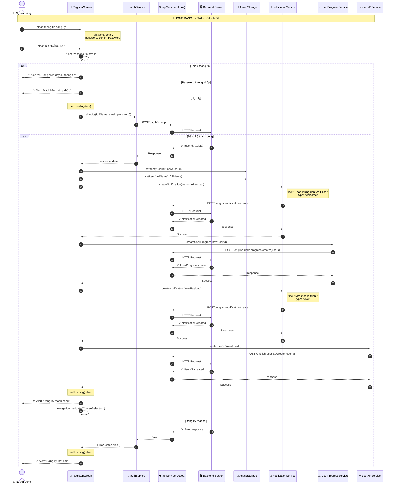

# Sơ Đồ Sequence - Luồng Đăng Ký (Register Flow)

## Tổng quan

Sơ đồ này mô tả luồng đăng ký tài khoản mới trong ứng dụng **Elisa**.

---

## Sequence Diagram

---

## Chi Tiết Các Bước

### 1️⃣ Nhập Thông Tin
Người dùng nhập các thông tin:
- **Họ và Tên** (`fullName`)
- **Email** (`email`)
- **Mật khẩu** (`password`)
- **Xác nhận mật khẩu** (`confirmPassword`)

### 2️⃣ Validate Dữ Liệu (Client-side)
Kiểm tra:
- Tất cả các trường không được để trống
- `password` và `confirmPassword` phải khớp

### 3️⃣ Gọi API Đăng Ký
- **Endpoint**: `POST /auth/signup`
- **Payload**: `{fullName, email, password}`

### 4️⃣ Lưu Thông Tin Local
Lưu vào `AsyncStorage`:
- `userId`: ID người dùng mới
- `fullName`: Họ tên người dùng

### 5️⃣ Tạo Notification Chào Mừng
- **Endpoint**: `POST /english-notification/create`
- **Type**: `"welcome"`

### 6️⃣ Tạo User Progress
- **Endpoint**: `POST /english-user-progress/create/{userId}`
- Khởi tạo tiến độ học tập cho user mới

### 7️⃣ Tạo Notification Mở Khóa Level
- **Type**: `"level"`
- Thông báo người dùng bắt đầu cấp độ "Tân Thủ"

### 8️⃣ Tạo User XP
- **Endpoint**: `POST /english-user-xp/create/{userId}`
- Khởi tạo điểm kinh nghiệm cho user mới

### 9️⃣ Điều Hướng
- Chuyển đến màn hình `CourseSelection` sau khi đăng ký thành công

---

## API Endpoints Liên Quan

| Service | Endpoint | Method | Mô tả |
|---------|----------|--------|-------|
| Auth | `/auth/signup` | POST | Đăng ký tài khoản |
| Notification | `/english-notification/create` | POST | Tạo thông báo |
| UserProgress | `/english-user-progress/create/{userId}` | POST | Tạo tiến độ user |
| UserXP | `/english-user-xp/create/{userId}` | POST | Tạo XP user |

---

## Files Liên Quan

| File | Đường dẫn | Mô tả |
|------|-----------|-------|
| RegisterScreen | `src/screens/AuthScreen/RegisterScreen.tsx` | Màn hình đăng ký |
| authService | `src/services/authService.ts` | Service xác thực |
| notificationService | `src/services/notificationService.ts` | Service thông báo |
| userProgressService | `src/services/userProgressService.ts` | Service tiến độ |
| userXPService | `src/services/userXPService.ts` | Service XP |
| apiService | `src/services/apiService.ts` | API service cơ sở |

---

## Ghi Chú

- Tất cả các request đều đi qua `apiService` (Axios) với timeout 10 giây
- Base URL: `http://localhost:8080/api` (dev) hoặc `https://api.your-production-domain.com/api` (prod)
- Dữ liệu được gửi dưới dạng JSON (`Content-Type: application/json`)

---

*Tài liệu được tạo tự động vào ngày 22/12/2025*
